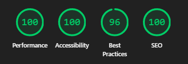

<div align="center">

# My Logs.

A minimal, fast, and beautiful personal blog — built for clarity, not clutter.

[](https://astro.build)


### 🚀 Performance


</div>

---

## ✨ Features

| Feature | Description |
|---------|-------------|
| ⚡ **Blazing Fast** | Static site generation with Astro for near-instant page loads |
| 🔍 **Client-Side Search** | Full-text search powered by Pagefind — no backend required |
| 🖼️ **Dynamic OG Images** | Auto-generated Open Graph images for every post using Satori |
| 📡 **RSS & Sitemap** | Automatically generated feeds for subscribers and SEO |
| 🤖 **LLM-Friendly** | Dynamic `llms.txt` and `llms-full.txt` generation |
| 🎨 **Dark/Light Mode** | Theme toggle with dynamic favicon adaptation |
| ♿ **Accessible & SEO-First** | Semantic HTML, proper meta tags, and JSON-LD structured data |
| ✍️ **MDX Support** | Write posts in Markdown with React-like components |
| 📝 **Draft Posts** | Keep work-in-progress posts hidden until ready |
| 📄 **Pagination** | Clean, numbered pagination for blog listings |
| 🔒 **Type-Safe** | End-to-end TypeScript with validated frontmatter schemas |
| ⚙️ **Configurable** | Single `site.config.ts` file to control entire site behavior |
| 📋 **Definition Lists** | Native Markdown definition list support |
| 📊 **Mermaid Diagrams** | Create flowcharts, sequence diagrams, and more |

---

## 🛠️ Tech Stack

| Category | Technologies |
|----------|--------------|
| **Framework** | [Astro](https://astro.build) |
| **Styling** | [Tailwind CSS v4](https://tailwindcss.com) |
| **Content** | [MDX](https://mdxjs.com), Remark, Rehype |
| **Search** | [Pagefind](https://pagefind.app) |
| **OG Images** | [Satori](https://github.com/vercel/satori), [@resvg/resvg-js](https://github.com/nickytonline/resvg-js) |
| **Icons** | [Iconify](https://iconify.design) via `astro-icon` |
| **Fonts** | [Fontsource](https://fontsource.org) (Source Serif 4, JetBrains Mono) |
| **Syntax Highlighting** | [Shiki](https://shiki.matsu.io) with custom transformers |
| **Dates** | [Day.js](https://day.js.org) |
| **Linting** | ESLint, Prettier |
| **Mermaid** | [Mermaid](https://mermaid.live) |

---

## 📁 Project Structure

```text
my-logs/
├── public/                   # Static assets & Pagefind index (favicons, og-image fallback)
├── src/
│   ├── components/           # Reusable UI components
│   │   └── mdx/              # MDX-specific components (Callout, etc.)
│   ├── content/
│   │   └── writing/
│   │       ├── blogs/        # Long-form blog posts (.md/.mdx)
│   │       └── short-reads/  # Quick notes and thoughts
│   ├── layouts/              # Page layouts (Base, Content, About)
│   ├── pages/                # File-based routing
│   ├── plugins/              # Custom Shiki transformers
│   ├── scripts/              # Client-side scripts (theme, back-url)
│   ├── styles/               # Global CSS and Tailwind config
│   ├── templates/            # OG image template
│   ├── utils/                # Helper functions
│   ├── content.config.ts     # Content collection schemas (Zod)
│   └── site.config.ts        # Global site configuration
├── astro.config.mjs          # Astro configuration
├── tailwind.config.js        # Tailwind configuration
├── tsconfig.json             # TypeScript configuration
├── vercel.json               # Vercel deployment settings
└── package.json
```

---

## 🚀 Getting Started

```bash
# Dev server with search index (test search locally)
npm run dev:index

# Build for production
npm run build

# Preview production build
npm run preview

# Sync content collections
npm run sync

# Check code formatting
npm run format:check

# Format code with Prettier
npm run format

# Lint code with ESLint
npm run lint
```

---

## ⚙️ Configuration

All site-wide settings live in **`src/site.config.ts`**:

```typescript
export const SITE = {
  website: PUBLIC_SITE_URL,
  author: 'Your Name',
  title: 'My Logs.',
  description: 'Your blog description',
  // ... more options
}
```

Content schemas are defined in **`src/content.config.ts`** for type-safe frontmatter validation.

---

## 📝 Writing Posts

1. Create a new `.md` or `.mdx` file in `src/content/writing/blogs/` or `src/content/writing/short-reads/`.
2. Use VS Code snippets (`frontmatter` or `template`) for quick scaffolding.
3. For MDX components, add them to `src/components/mdx/` and export from `index.ts`.

---

## License

MIT © 2026 Aayushmaan Soni

---

<div align="center">

**Made with ☕ and [Astro](https://astro.build)**

</div>
