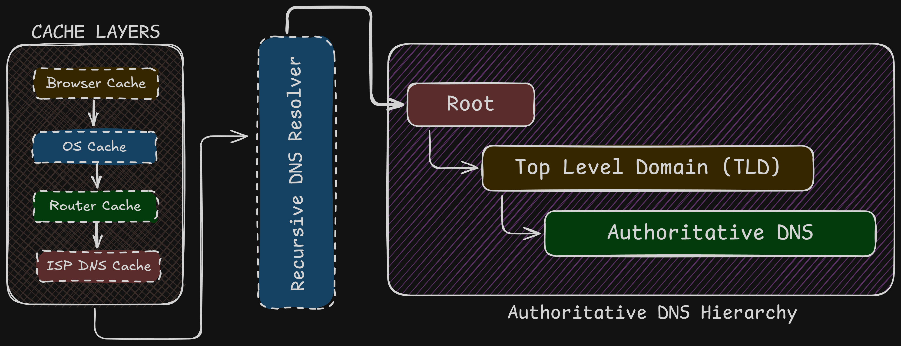

## Table of Contents

## Introduction
Have you ever wondered what actually happens when you type a website address into your browser and press Enter?  
Behind the scenes, a lot of things happen in just a few milliseconds to turn that human-readable domain name into an IP address that computers can understand. This entire process is handled by something called the **Domain Name System (DNS)**.  
DNS might sound simple on the surface, but it's actually a well-designed system with multiple layers working together - caches, resolvers, and different types of servers all cooperating to get you the correct website as fast as possible.  
If you've ever worked with custom domains, you've probably seen DNS records and copied values into fields like **A, CNAME, or TXT**, often without fully knowing what they do. This post aims to change that.

**What you'll learn in this post:**
- How DNS resolution actually works (the full journey from browser to server)
- Why there are so many cache layers and how they speed things up
- What happens during DNS propagation and how to avoid downtime
- How ISPs can track your DNS activity and what you can do about it
- Common DNS problems like negative caching and DNS leaks

By the end, you'll have a clear mental model of DNS and feel much more confident working with it.

## What is DNS?
So what is DNS?  
Basically, it's the **phonebook of the internet**. It stores domain names in a human-readable format and maps them to their respective IP addresses.  
This is done because we humans can't remember IP addresses easily. But to connect to anything on the internet, an IP address is required. So we need a system that converts domain names into IPs.  
Another reason DNS exists is because servers can change. If a website changes its server, the IP address may also change. Updating the IP everywhere for users would be painful and messy. With DNS, only the mapping is updated, and users don't have to worry about anything.  
So basically, a domain is just a mapping to an IP address - just like how in your phone you save someone's contact as "Mom" and when you call, the actual number is dialed automatically. You don't need to remember the number.

## What happens when you enter a URL in the browser
So what actually happens when you enter a URL in your browser address bar?  
A lot of things happen in the background, and the first important step is finding the IP address of the domain.

### Step 1: Checking cache layers
Before making any external DNS requests, your system checks multiple cache layers. Think of it like looking for your keys - you check your pocket first, then the table, then the bedroom, before searching the whole house.  
**1. Browser Cache**
First, the browser checks its own cache. Modern browsers like Chrome store DNS records for about 60 seconds by default. If you've visited `aayushmaan.me` recently, the IP is already sitting in memory.

**2. OS Cache**
If the browser cache misses, the request goes to the operating system's DNS cache. On Windows, this is managed by the DNS Client service. On Mac/Linux, it's handled by `systemd-resolved` or `mDNSResponder`. This cache typically holds records for a few minutes to hours depending on the TTL.

**3. Router Cache**
Your home router also maintains its own DNS cache. When your router first resolves a domain, it stores the result so other devices on your network can benefit. This is why sometimes clearing your browser cache doesn't help - the router is still serving the old IP.

**4. ISP DNS Cache**
Finally, your ISP's DNS servers have their own massive cache serving millions of users. If someone else in your city visited the same website recently, the ISP cache already has the answer.

**Why so many layers?**

Each cache layer serves a purpose:
- **Speed**: Checking local cache takes microseconds vs milliseconds for network requests
- **Reduced load**: Without caching, DNS servers would be flooded with billions of duplicate requests
- **Resilience**: If one layer fails, others can still serve cached results

Here's the reality: about 90% of DNS queries never leave your local network because of these caches. That's why websites feel instant even though DNS resolution involves multiple steps.

### What if the IP is still not found?
If none of the cache layers have the IP, then the real DNS lookup begins. This is where the **Recursive DNS Resolver** comes in.

## Recursive DNS Resolver
The DNS Resolver is usually provided by your ISP.  
You may also use public DNS servers like:
- 1.1.1.1 by Cloudflare
- 8.8.8.8 by Google

These are called recursive DNS servers.

Their job is to take your domain name and find the correct IP address. To do this, they contact multiple DNS servers step by step until the correct one is found.

Once the IP is found:
- It is returned to your browser
- It is cached for future use
- The browser uses it to connect to the server

These resolvers are highly optimized and help reduce load on DNS servers across the world.

## Authoritative Name Server
After cache lookup fails, the Recursive DNS Resolver starts querying authoritative DNS servers.  
The authoritative DNS server is the **final source of truth** for a domain. It stores the actual DNS records like A, AAAA, CNAME, MX, etc.  
But this process happens in a **hierarchical way**.  
Let's understand it using this example:
```
logs.aayushmaan.me
```

### Step 1: Root DNS Server
First, the recursive resolver asks the **Root DNS server**: "Who handles the `.me` domain?"   
The root server does **not** know the IP address. It only replies with: "These are the name servers responsible for `.me` domains."

### Step 2: TLD DNS Server (.me)
Next, the resolver asks the **.me TLD DNS server**: "Who handles `aayushmaan.me`?"  
The TLD server responds with: "These are the authoritative DNS servers for `aayushmaan.me`."

### Step 3: Authoritative DNS Server
Now the resolver asks the **authoritative DNS server**: "What is the IP address of `logs.aayushmaan.me`?"
This server finally responds with the actual record:
```
logs.aayushmaan.me → 192.xxx.xxx.xxx
```

This is the final answer.

### Step 4: Caching
Once the IP is found:
- The resolver caches it
- The browser gets the IP
- Future requests become faster

This caching helps reduce load on DNS servers worldwide.

### DNS Resolution Flow Explained

*DNS resolution flow showing cache layers, recursive resolver, and authoritative DNS hierarchy.*

The diagram above shows how DNS resolution actually works behind the scenes.  
When a user enters a domain name, the browser first checks multiple cache layers like browser cache, OS cache, router cache, and ISP DNS cache. If the IP address is not found in any of these layers, the request is forwarded to a **recursive DNS resolver**.

The recursive resolver then follows the DNS hierarchy:
- It first contacts the **Root DNS server**
- Then the **Top Level Domain (TLD) server**
- And finally the **Authoritative DNS server**

The authoritative DNS server returns the actual IP address of the domain. This IP is then cached and sent back to the browser, which uses it to connect to the website.  
This hierarchical and cached approach makes DNS fast, scalable, and reliable.

## About the "13 DNS Root Servers"
There is a website called https://root-servers.org, which shows all 13 DNS root servers in the world labeled from `A.root-servers.net` → `M.root-servers.net`.   
But here's the thing - there aren't actually 13 physical root DNS servers in the world. Each one is actually a **global cluster** using **Anycast**, spread across **hundreds of locations worldwide**.  
So when your system queries a root server, it connects to the **nearest instance**, not a single machine.  
These are just 13 names of servers, not actually 13 physical servers.

## DNS Propagation
DNS propagation refers to the time it takes for DNS changes to be updated and reflected across the internet.  
When you update a DNS record (like changing an IP address when switching hosting platforms), the change does not happen instantly everywhere. This delay is what we call **DNS propagation**.

### Why propagation happens
The delay happens mainly because of **DNS caching** at multiple levels. DNS records are cached everywhere - in browsers, operating systems, routers, ISP resolvers, and even intermediate DNS servers around the world.  
Each of these caches stores DNS records for a certain time defined by **TTL (Time To Live)**.

**Example scenario:**
Let's say you're migrating your website from HostGator to Vercel:  
1. Your old DNS record has: `aayushmaan.me → 192.168.1.100` (HostGator IP) with TTL = 3600 seconds (1 hour)
2. You update it to: `aayushmaan.me → 76.76.21.21` (Vercel IP)
3. But people around the world still have the old IP cached for up to 1 hour
4. During this time, some users see your new site (Vercel) while others see the old one (HostGator)

This is why you might see "failure to connect" or mixed content when changing hosting platforms.

### How long does propagation take?
A higher TTL results in slower propagation, while a lower TTL allows changes to spread faster.

**Real-world propagation times:**
- Local cache (browser/OS): Minutes
- ISP DNS cache: 1-4 hours typically
- Global propagation: 24-48 hours to reach everyone

### Best practices for smooth migrations
**Before migration:**
1. Lower your TTL to 300 seconds (5 minutes) at least 24-48 hours before the change
2. This ensures old caches expire quickly when you make the actual change
3. Wait for the old long TTL to expire first

**During migration:**
1. Update your DNS records to point to the new server
2. Keep both old and new servers running during propagation
3. Monitor both servers to see when traffic shifts completely

**After migration:**
1. Once propagation is complete (24-48 hours), you can increase TTL back to 3600 or higher
2. Now you can safely shut down the old server

### Troubleshooting DNS propagation issues
**Check if DNS has propagated globally:**
- Use https://www.whatsmydns.net/ to check DNS from different locations
- Use `dig @8.8.8.8 yourdomain.com` to check Google's DNS
- Use `dig @1.1.1.1 yourdomain.com` to check Cloudflare's DNS

**Clear caches if needed:**
```bash
# Clear browser cache: Hard refresh (Ctrl+Shift+R or Cmd+Shift+R)

# Clear OS cache:
# Windows
ipconfig /flushdns

# Mac
sudo dscacheutil -flushcache; sudo killall -HUP mDNSResponder

# Linux
sudo systemd-resolve --flush-caches
```

<Callout type="note">
You cannot clear ISP-level caches manually - you have to wait for them to expire based on TTL.
</Callout>

## Negative Cache Problem
Negative caching is a lesser-known DNS behavior that can cause confusion during development and deployment.  
It happens when a DNS resolver **caches a failed DNS lookup**. In simple words, if a DNS record does not exist, that failure itself can be cached.

### Why negative caching exists
Without negative caching, every single typo or non-existent domain would cause repeated queries to authoritative DNS servers. Imagine millions of users mistyping "gooogle.com" or "facebok.com" - without negative caching, these failed lookups would flood DNS servers.  
So DNS resolvers cache the "this domain doesn't exist" response (called **NXDOMAIN**) just like they cache successful responses.

### When negative caching becomes a problem
**Scenario 1: Setting up a new subdomain**
You're deploying a new project:
1. You visit `logs.aayushmaan.me` before creating the DNS record
2. DNS returns NXDOMAIN (domain not found)
3. Your browser/OS caches this failure for 5-10 minutes
4. You create the DNS record: `logs.aayushmaan.me → 192.168.1.50`
5. You refresh the browser, but still see "domain not found"
6. The DNS record exists, but your system is using the cached negative response

**Scenario 2: Deleting and recreating records**
You delete a CNAME record, then immediately recreate it with a different target. The brief moment when it didn't exist gets cached as NXDOMAIN, causing temporary failures even after recreation.

### How long does negative cache last?
It depends on the **SOA (Start of Authority)** record's minimum TTL field:

```bash
# Check SOA record
dig SOA aayushmaan.me

# Example response:
aayushmaan.me. 3600 IN SOA ns1.cloudflare.com. dns.cloudflare.com. (
    2024011801 ; Serial
    10000      ; Refresh
    2400       ; Retry
    604800     ; Expire
    300        ; Minimum TTL <- This value!
)
```

The **Minimum TTL** (last value) defines how long negative responses are cached. Common values:
- Cloudflare: 300 seconds (5 minutes)
- Google Cloud DNS: 300 seconds
- Some older setups: 600-3600 seconds (10 minutes to 1 hour)

Different DNS resolvers also have their own policies:
- Google DNS (8.8.8.8): Usually respects SOA minimum
- Cloudflare DNS (1.1.1.1): Usually respects SOA minimum
- ISP DNS: Can vary, sometimes cache longer

### How to avoid negative cache problems
**1. Always create DNS records before testing**
Don't visit a subdomain URL until after you've created the DNS record. This is the simplest prevention.

**2. Use DNS-specific testing tools**
Instead of opening the URL in your browser, use:
```bash
# Check if DNS record exists without caching the result
dig logs.aayushmaan.me
nslookup logs.aayushmaan.me

# Or use online tools that query from different locations
# https://dnschecker.org
# https://www.whatsmydns.net
```

**3. Set reasonable SOA minimum TTL**
If you control your DNS zone, set the SOA minimum TTL to 300 seconds (5 minutes) instead of higher values like 3600 seconds (1 hour).

**4. Clear local DNS cache**
If you've already hit the negative cache:

```bash
# Windows
ipconfig /flushdns

# Mac
sudo dscacheutil -flushcache; sudo killall -HUP mDNSResponder

# Linux
sudo systemd-resolve --flush-caches

# Chrome browser (visit this URL)
chrome://net-internals/#dns
# Then click "Clear host cache"
```

**5. Wait it out**
If clearing local cache doesn't work, the negative response is cached at ISP level. You'll need to wait for the SOA minimum TTL to expire (usually 5-10 minutes).

**Pro tip for developers:**
When developing locally, use `/etc/hosts` file (or `C:\Windows\System32\drivers\etc\hosts` on Windows) to map domains directly to IPs. This bypasses DNS entirely:
```
127.0.0.1 api.myproject.local
192.168.1.50 staging.myproject.local
```

## How ISPs Can See Your Activity
When you use the internet, all your traffic first goes through your **Internet Service Provider (ISP)**.  
This means your ISP sits between you and the websites you visit. Because of this, your ISP can see certain parts of your internet activity - even when you think you're browsing privately.

### What exactly can an ISP see?
**Even with HTTPS encryption**, your ISP can still see:
1. **DNS queries**: Every domain you look up (`youtube.com`, `github.com`, etc.)
2. **Destination IP addresses**: Where your traffic is going
3. **Connection metadata**: When you connected, how long, how much data transferred
4. **SNI (Server Name Indication)**: The hostname you're connecting to, sent in plaintext during TLS handshake

**What they can't see:**
- The actual content of HTTPS traffic (what you type, what pages you view)
- Form data, passwords, messages
- Specific URLs (they see `github.com` but not `github.com/aayushmaan/my-secret-project`)

**Why this happens:**
DNS requests are sent in **plain text** by default. Your ISP's routers handle all your traffic, so they can easily log:
```
User 192.168.1.100 queried facebook.com at 10:30 AM
User 192.168.1.100 queried instagram.com at 10:35 AM
User 192.168.1.100 queried youtube.com at 10:40 AM
```

### Do ISPs actually track users?
Yes, in many cases:
**Legal requirements:**
- In many countries, ISPs are legally required to log DNS queries for 6-12 months
- Government agencies can request this data with proper authorization
- In India, for example, ISPs must maintain logs as per government regulations

**Commercial reasons:**
- Network optimization and traffic analysis
- Targeted advertising (in some regions)
- Content filtering and parental controls
- Bandwidth management

This doesn't always mean "evil spying", but **technically they have the capability** to see your DNS activity and build a profile of your browsing habits.

### Solutions: How to protect your DNS privacy
Let's look at different solutions, from simple to more advanced.

---

### Solution 1: Use Public DNS Servers
**What it does:** Moves DNS resolution away from your ISP to a third party.
**Popular options:**
- Cloudflare DNS: `1.1.1.1` and `1.0.0.1`
- Google DNS: `8.8.8.8` and `8.8.4.4`
- Quad9: `9.9.9.9`

**How to set it up:**
On Windows:
```
Settings → Network & Internet → Change adapter options → 
Right-click your connection → Properties → Internet Protocol Version 4 → 
Use the following DNS server addresses: 1.1.1.1, 1.0.0.1
```

On Mac:
```
System Preferences → Network → Advanced → DNS → 
Add 1.1.1.1 and 1.0.0.1
```

**Privacy level:** ⭐⭐ (2/5)

**Reality check:**
- Your ISP can still see that you're talking to Cloudflare/Google DNS servers
- They can see the destination IPs you connect to after DNS resolution
- You're now trusting Cloudflare/Google instead of your ISP
- They can still see SNI in TLS handshakes

---

### Solution 2: Pi-hole (Network-wide ad blocking)
**What it is:** A Raspberry Pi running DNS-based ad blocker on your network.

**What it does:**
- Blocks ads and trackers at DNS level (before they even load)
- Works for all devices on your network automatically
- No need to install ad blockers on each device
- You can see which domains your devices are querying

**Privacy level:** ⭐⭐ (2/5)

**Important limitation:**
- Pi-hole alone does NOT hide DNS from your ISP
- It only filters which domains get resolved (blocks ads/trackers)
- DNS queries still go out to the internet
- ISP can still see your DNS traffic

Great for ad blocking, but not for privacy from ISP.

---

### Solution 3: Pi-hole + Unbound (More private)

**What this adds:** Unbound is a recursive DNS resolver that runs locally.

**How it works:**
```
Your device
    ↓
Pi-hole (filters ads/trackers)
    ↓
Unbound (resolves DNS locally, queries root servers directly)
    ↓
Internet (DNS root servers)
```

**Benefits:**
- No third-party DNS servers (no Google, Cloudflare)
- You query root DNS servers directly
- More privacy, more control

**Privacy level:** ⭐⭐⭐ (3/5)

**But ISP can still:**
- See queries to root DNS servers
- See final destination IPs
- See SNI in TLS handshakes

---

### Solution 4: VPN (The most common solution)

**What it does:** Creates an encrypted tunnel for all your traffic.

**Privacy level:** ⭐⭐⭐⭐ (4/5) - if configured correctly

**What your ISP sees with VPN:**
- You're connected to a VPN server (IP address)
- Encrypted data flowing to VPN server
- Amount of data transferred

**What your ISP can't see:**
- DNS queries (if VPN handles DNS)
- Destination websites
- Your actual traffic

**But there's a catch:** Many VPNs leak DNS! See the next section.

---

### Solution 5: Pi-hole + Unbound + VPN (Maximum privacy)

**The ultimate setup:**
```
Your device
    ↓
VPN (encrypted tunnel)
    ↓
Pi-hole (ad/tracker blocking)
    ↓
Unbound (recursive DNS)
    ↓
Internet
```

**Privacy level:** ⭐⭐⭐⭐⭐ (5/5)

**What this achieves:**
- VPN encrypts everything (including DNS)
- ISP sees only encrypted VPN traffic
- Pi-hole blocks ads network-wide
- Unbound ensures no DNS logging by third parties

This is the setup I use personally. If you want a detailed tutorial on setting this up, let me know - I'll write a dedicated blog post on it!

## Common DNS Record Types (Explained Like You've Actually Seen Them Before)
If you've ever:
- bought a domain
- connected it to hosting
- used Cloudflare
- set up email
- added a custom domain to Vercel / Netlify

Then you've already seen these, but probably thought: *"I'll just copy-paste what the tutorial says."*

Let's fix that 😄

- **A Record** - "This domain points here": Maps a domain → IPv4 address. Given by the hosting platform so when a user types your domain they know where it points to, which IPv4 address.
- **AAAA Record**: Same as A, but for IPv6 address. We usually don't do this - the hosting platform automatically adds this.
- **CNAME** - Alias: Points one domain to another domain (`www.aayushmaan.me` → `aayushmaan.me` or `blogs.aayushmaan.me` → `logs.aayushmaan.me`)
- **MX Record** - Email Routing: This tells the internet, "Where should emails for this domain go?" `hello@aayushmaan.me` → `feedback-smtp.resend.com` (Resend Email redirection)
  - *SPF Record*: For proper email delivery & no spam issues
  - *DKIM Record*: Adds a digital signature to your email to prove that the email wasn't tampered with. It is for email spoofing, email modification, and fake emails
  - *DMARC Record*: What to do if SPF/DKIM fails - we provide options here on what to do.
- **TXT Record** - Verification & Security Stuff: It is used for domain verification, email security, ownership proof, and anti-spam rules
- **NS Record** - Who controls your DNS: Nameservers decide who manages your DNS. (ns1.cloudflare.com, ns2.cloudflare.com)
- **PTR Record** - Reverse DNS: Opposite of A record, used for email validation or spam prevention.

## How DNS Leaks Happen (Even with VPN)
Most people think:
> I turned on VPN → I'm 100% hidden

❌ Not always true.

A **DNS leak** happens when your DNS queries bypass the VPN tunnel and go directly through your ISP - completely defeating the purpose of the VPN.

### Common causes of DNS leaks
**1. OS uses default DNS (Most Common)**
When you connect to a VPN, your OS should route all DNS queries through the VPN tunnel. But many cheap VPNs don't enforce this properly.

What happens:
- VPN encrypts your web traffic ✅
- But DNS queries still go to ISP's DNS server ❌
- ISP can see every website you visit
- No privacy at all

**Example:**
```
You: Connect to VPN
Your OS: "I'll encrypt web traffic through VPN"
Your OS: "But for DNS, I'll still use 192.168.1.1 (router/ISP)"
ISP: *sees all your DNS queries*
```

**2. IPv6 Leak (Very Common)**
Most VPNs only tunnel IPv4 traffic. If your system has IPv6 enabled, it can bypass the VPN entirely.

What happens:
- IPv4 traffic → VPN tunnel ✅
- IPv6 traffic → ISP directly ❌
- DNS queries over IPv6 → ISP ❌

This is especially common on modern networks where IPv6 is enabled by default.

**3. WebRTC Leak (Browser Level)**
WebRTC is used for video calls, P2P connections, and real-time communication in browsers.  
The problem: WebRTC can reveal your real IP address even when connected to VPN.

How it works:
- Your browser uses WebRTC for video calls
- WebRTC makes STUN requests to discover your real IP
- This happens outside the VPN tunnel
- Your real IP gets leaked

This is why some websites can detect you're using a VPN - they're seeing your real IP through WebRTC.

**4. Split Tunneling Enabled**
Some VPN apps let you choose which apps use the VPN and which don't. This is called "split tunneling".

If configured incorrectly:
- Some apps might bypass VPN by default
- System DNS requests might not go through VPN
- Leads to DNS leaks

**5. VPN doesn't force DNS**
Cheap or poorly configured VPNs don't:
- Force all DNS through their tunnel
- Block DNS requests outside the tunnel
- Support IPv6
- Provide a kill switch (stops internet if VPN drops)

### How to check if you have DNS leaks
**Method 1: Use online tools**
1. Connect to your VPN
2. Visit: https://dnsleaktest.com or https://www.dnsleaktest.org
3. Click "Extended test"
4. Check the results:
   - ✅ Good: You see your VPN provider's DNS servers
   - ❌ Leak: You see your ISP's name or your actual country/city

**Method 2: Command line check**

While connected to VPN:
```bash
# Windows
nslookup whoami.akamai.net

# Mac/Linux
dig +short whoami.akamai.net
```

Compare the IP with your real IP. If they match, you have a leak.

### How to prevent DNS leaks
**1. Use VPN with built-in DNS**
Choose VPNs that:
- Force all DNS through their servers
- Have leak protection built-in
- Support IPv6 (or disable it)

**Good options:**
- Mullvad: Strong privacy, blocks DNS leaks automatically
- ProtonVPN: Built-in DNS leak protection
- IVPN: Privacy-focused, prevents leaks

**2. Manually configure DNS**
Force your system to use the VPN's DNS only:

**Windows:**
```
Network Settings → Change adapter options → 
VPN adapter → Properties → IPv4 → 
Use VPN's DNS addresses only
```

**Mac:**
```
System Preferences → Network → VPN → Advanced → DNS →
Remove all other DNS servers, keep only VPN's DNS
```

**3. Disable IPv6**
Since most VPNs don't support IPv6 properly, disable it:

**Windows:**
```bash
# Disable IPv6 on all adapters
netsh interface ipv6 set global randomizeidentifiers=disabled
```

**Linux:**
```bash
# Add to /etc/sysctl.conf
net.ipv6.conf.all.disable_ipv6 = 1
net.ipv6.conf.default.disable_ipv6 = 1

# Apply changes
sudo sysctl -p
```

**Or on router level:**
- Login to router admin panel
- Find IPv6 settings
- Disable IPv6 completely

**4. Block WebRTC in browser**
**Chrome/Edge:**
- Install extension: "WebRTC Leak Prevent"
- Or use uBlock Origin with "Prevent WebRTC from leaking local IP addresses" enabled

**Firefox:**
```
about:config → search "media.peerconnection.enabled" → set to false
```

**Brave:**
```
Settings → Privacy and security → WebRTC IP handling policy → 
"Disable non-proxied UDP"
```

**5. Enable Kill Switch**
A kill switch stops all internet traffic if VPN disconnects - preventing accidental leaks.

Most good VPNs have this built-in:
- Mullvad: "Always require VPN"
- ProtonVPN: "Kill Switch"
- NordVPN: "Kill Switch"

**6. Use Pi-hole + Unbound + VPN (Advanced)**
For maximum protection:
```
Device → VPN → Pi-hole → Unbound → Internet
```

This ensures:
- All DNS goes through VPN tunnel
- Pi-hole filters ads/trackers
- Unbound handles recursive resolution
- Zero DNS leaks possible

### The reality check
**VPN protects you IF:**
- It forces DNS through the tunnel ✅
- IPv6 is disabled or tunneled ✅
- WebRTC is blocked ✅
- Kill switch is enabled ✅

**VPN doesn't protect you IF:**
- DNS still goes through ISP ❌
- IPv6 leaks outside tunnel ❌
- WebRTC reveals real IP ❌
- No kill switch when VPN drops ❌

**Bottom line:** VPN is powerful, but only if configured correctly. Always test for leaks after connecting.

## Want to Go Deeper into DNS?
If you want to truly understand how DNS works under the hood (not just memorize terms), this is one of the best resources out there:

👉 **DNS Explained - Wizard Zines**
https://wizardzines.com/zines/dns

It covers:
- How DNS resolution actually works
- What happens behind the scenes (root → TLD → auth)
- DNS packets, caching, and common misconceptions

Highly recommended if you want a deeper, practical understanding of DNS.

---

## Conclusion
DNS may look simple on the surface, but under the hood it's a highly optimized, globally distributed system.

From recursive resolution to caching, root servers, and smart routing - all of this happens in **milliseconds**, every single time you open a website.

**Key takeaways:**
- DNS uses multiple cache layers to make lookups instant
- DNS propagation is real - plan migrations carefully
- Negative caching can bite you if you test domains before they exist
- ISPs can see your DNS activity unless you use encryption (VPN, DoH, DoT)
- VPNs can leak DNS if not configured properly

That speed and reliability come from DNS's layered architecture, smart caching, and decades of engineering - which is why the internet feels instant, even though so much work happens behind the scenes.

Now that you understand how DNS works, you'll be able to:
- Debug DNS issues faster
- Plan smoother website migrations
- Protect your privacy better
- Make smarter decisions when configuring domains

If this helped you understand DNS better, consider sharing it with others who might find it useful!
